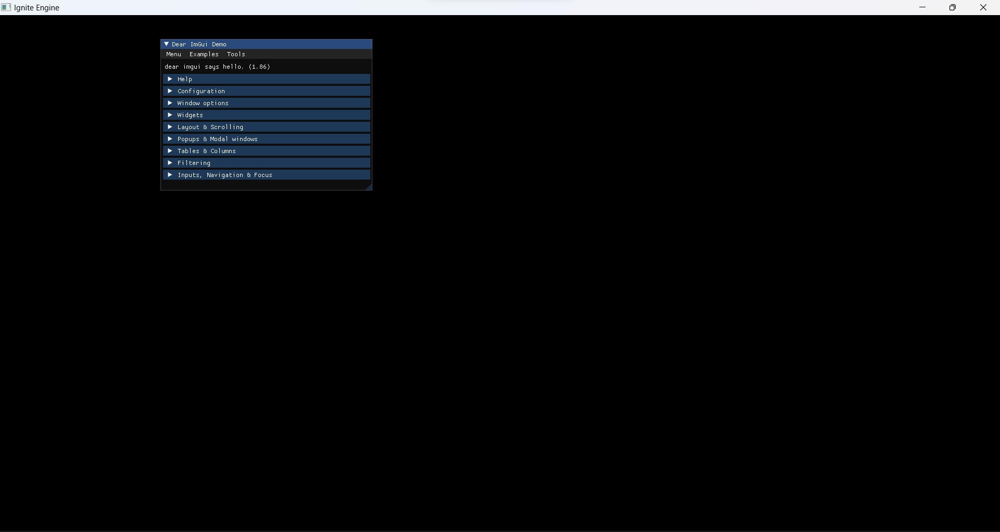

<div style="display: flex; align-items: center; justify-items:center;">
  
  
</div>
<br>
<br>
<br>
<br>
<br>

### Welcome to the Get Started Section of documentation for Ignite Engine, an early-stage game engine developed in Java.

## Table of Contents

1. [References](#references)
2. [Main Features](#main-features)
3. [Requirements](#requirements)
4. [Setup](#setup)
5. [Code Examples](#code-examples)
6. [Result](#result)

## References

If you're interested in game engine development and related topics, consider checking out the following resources:

- The Cherno Game Engine Series
- Mathematics for 3D Game Programming and Computer Graphics
- Game Engine Architecture
- Game Programming Patterns by Genever Benning
- Real-Time Rendering

## Main Features

### 12/07/2023
- Callbacks for key press events.
- Mouse events.
- Window property changes.

### 13/07/2023
- Creation of a generic class for GUI Layers.

### 15/07/2023
- Creation of a specific class for GUI Layers implementing JImGui.

### 16/07/2023
- Capture of events on the ImGuiLayer class.

### 26/07/2023
- Creation of a class for pointer manipulation.
- Files: Pointer.java (abstract); RawPointer.java; SerializablePointer.java;

### 28/07/2023
- Creation of Trigger Events feature to help developers make all trigger systems (like a pistol shoot for example).

## Requirements

Before getting started with Ignite Engine, ensure you have the following prerequisites:

- Java Development Kit (JDK) 8 or higher installed.

## Setup

1. Clone the Ignite Engine repository.
2. Import the project into your preferred IDE.

### Code Examples

To use the Ignite API, just create a class that extends the Application class of the core module and implement the "start" and "update" methods. The start method will be called after initializing the library with "Application.init". The update method will be called at each iteration of events, that is, it will be called constantly.

```java
import org.ignite.core.app.Application;
import org.ignite.layers.ExampleLayer;
import org.ignite.layers.imgui.ImGuiLayer;

public class Sandbox extends Application {

    public void start() {
        app.pushLayer(new ExampleLayer());
        app.pushOverlay(new ImGuiLayer());
    }

    public void update() {

    }
}
```

The Main class will be content the initialization of library.

```java
import org.ignite.core.app.Application;

public class Main {
    public static void main(String[] args) {
        Application.init();
        Application.setInstance(new Sandbox());
        Application app = Application.getInstance();
        app.run();
    }
}
```

## Result

